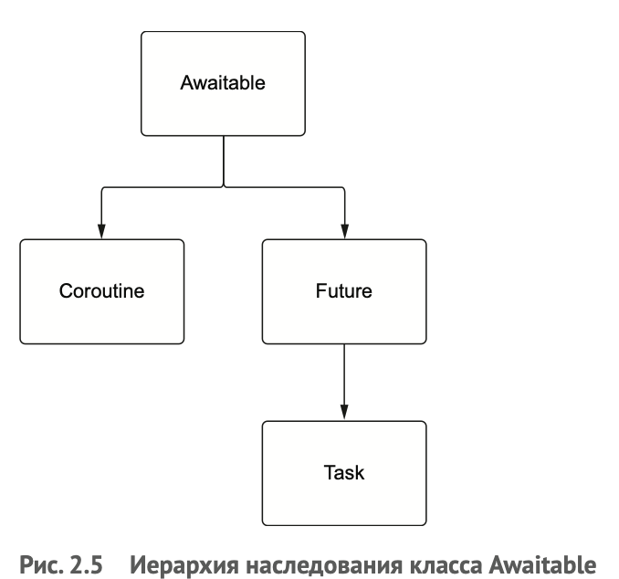

<h1> Изучение Asyncio по книге "Asyncio и конкурентное программирование на Python" MATTHEW FOWLER </h1>
<h2> Конспект </h2>

<h3> 2.4 Снятие задач и задание тайм-аутов </h3>
Потенциальная проблема в <b>create_task_2</b> заключается в том, что задача может работать неопределенно долго. 
В рассмотренных примерах если бы задачи работали вечно, то мы бы застряли в предложении await без всякой обратной связи. 
И остановить бы программу не смогли, даже если бы захотели.
В библиотеке asyncio предусмотрены обе ситуации – мы можем снять задачу или задать тайм-аут.

У каждого объекта задачи есть <b>метод cancel</b>, который можно вызвать, если требуется остановить задачу. 
В результате снятия задача возбудит исключение CancelledError, когда мы ждем ее с помощью await. 
Пример в файле <b>cancelled_task</b>

<h3> Задание тайм-аута и снятие с помощью wait_for </h3>
В asyncio есть возможность передать отслеживание в виде функции asyncio.wait_for. Она принимает объект 
сопрограммы или задачи и тайм-аут в секундах и возвращает сопрограмму, к которой можно применить await. 
Если задача не завершилась в отведенное время, то возбуждается исключение TimeoutError и задача автоматически снимается.
Пример в файле <b>wait_for</b>

Автоматическое снятие задачи, работающей дольше, чем ожидается, обычно является разумной практикой. 
В противном случае сопрограмма могла бы ждать неопределенно долго, занимая ресурсы, которые никогда не будут освобождены. 

<h4> Защита задачи от снятия </h4>
Для этого обернем нашу задачу функцией asyncio.shield. Эта функция предотвращает снятие сопрограммы, снабжая ее «щитом», позволяющим игнорировать запросы на снятие.
Пример в файле <b>shield_example</b>

<h3> 2.5 Задачи, сопрограммы, будущие объекты и объекты, допускающие ожидание </h3>

Рассмотрим пример – <b>future_object</b> – отправка веб-запроса возвращает объект future. В этом примере случае future 
возвращается немедленно, но, поскольку запрос занимает некоторое время, значение future еще не определено. 
Позже, когда запрос завершится, результат будет установлен, и мы сможем его получить. 

Между задачами и будущими объектами существует тесная связь. На самом деле task напрямую наследует future. Можно считать, 
что объект future представляет значение, которое появится только в будущем. А task является комбинацией сопрограммы и future. 
Создавая задачу, мы создаем пустой объект future и запускаем сопрограмму. А когда сопрограмма завершится с результатом или вследствие
исключения, мы записываем этот результат или объект-исключение во future.

Связующим звеном между задачами и сопрограммами является абстрактный базовый класс Awaitable. Любой объект, который реализует метод __await__, 
можно использовать в выражении await. Сопрограммы, как и будущие объекты, наследуют Awaitable напрямую, а задачи же расширяют будущие объекты.

<h3> 2.6 Измерение времени выполнения сопрограммы с помощью декораторов </h3>
Это поможет составить четкое представление о том, какой выигрыш в производительности дает конкурентность.
Нужно внимательно следить за тем, чтобы не попасть в одну из типичных ловушек, которые могут не повысить, а снизить производительность приложения.

